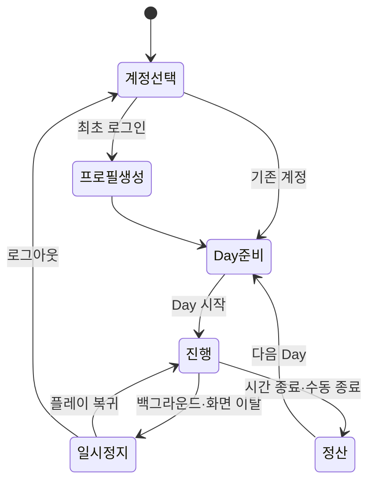

# Day·계정 기반 플레이 세션 실험안

> 관련 Issue: #207, #209, #210, #211, #212, #213, #214  
> 1차 선택안: B안 — 활성 플레이 시간 + 소프트 Day 종료

## 1. 목표와 범위

게임 시작 전에 계정 세션을 만들고, 계정별 게임 프로필과 진행을 분리한다. 각 플레이 세션은 Lab에서 빠르게 반복 검증할 수 있도록 10초짜리 Day로 묶으며 실제 플레이 화면이 활성 상태일 때만 시간을 차감한다. 시간 종료 뒤에는 오늘 수입 정산을 확인하고 다음 Day를 명시적으로 시작한다.

이번 구현은 Lab 검증용이다. 실서비스 비밀번호, 토큰, 실제 Toss 사용자 정보는 저장하지 않는다. `BrowserMockAuthProvider`를 나중에 플랫폼 인증 어댑터로 교체할 수 있도록 인증 경계를 분리했다.

## 2. 상태 흐름

## 3. 데이터 계약

| 영역 | 주요 필드 | 소유·저장 단위 |
|---|---|---|
| 인증 세션 | `playerId`, `displayName`, `provider`, `issuedAt` | 브라우저 세션, 테스트 계정 |
| 게임 프로필 | `playerId`, `nickname`, `createdAt`, `lastPlayedAt` | 계정별 로컬 프로필 |
| 현재 Day | `dayNumber`, `status`, `remainingMs`, `startedAt`, `lastResumedAt`, `settlementRevision` | 계정별 진행 |
| 진행 | `coins`, `orderIndex`, `completedOrders`, `dreamBikeLevel`, `unlockedBikeIds` | 계정별 진행 |
| 정산 기록 | Day, 종료 사유, 보상, 완료 주문 수, 종료 시각 | 계정별 append-only 이력 |
| 설정 | BGM, SFX, 진동 | 현재는 계정별 진행 |

저장 키는 프로필 목록과 `playerId`별 진행 슬롯으로 나눈다. 저장 시 revision을 증가시키고, Day 정산은 `settlementRevision`과 상태 검사로 중복 보상을 막는다.

## 4. Day 규칙 비교

| 안 | 시간 차감 | 장점 | 위험 | 1차 판단 |
|---|---|---|---|---|
| A 실제 시각 | 시작 뒤 앱 밖에서도 계속 | 마감 감각이 강함 | 전화·앱 전환에도 손실 발생 | 후속 비교 |
| B 활성 플레이 | 게임 플레이 화면이 활성일 때만 | 중단 복귀 안전, 테스트 해석 명확 | 긴장감이 A보다 약함 | **1차 권장·구현** |
| C 행동 횟수 | 머지·주문 등 행동 시 차감 | 디바이스 성능과 무관 | 규칙·밸런스 비용 증가 | 후속 비교 |

Day 종료는 실패가 아니라 소프트 정산이다. 미완료 주문 번호는 다음 Day에 유지하지만 임시 보드 배치는 초기화한다. 이 규칙은 보드 스냅샷 계약이 확정되기 전 데이터 결합을 피하기 위한 Lab 한정 선택이다.

Day 진행 중 자전거 한 대를 완성하면 별도 보상 화면으로 이동하지 않는다. 납품 보상과 오늘 수입을 즉시 반영하고, 남은 보드 부품을 유지한 채 다음 자전거 주문을 바로 시작한다.

## 5. 자동 저장 시점

- 프로필 생성, Day 시작·일시정지·재개·정산
- 주문 완료와 보상 반영
- 플레이 중 약 5초 간격 체크포인트
- `visibilitychange`로 백그라운드 전환
- 화면 이동, 로그아웃, 컨트롤러 종료

새로고침 뒤 세션이 남아 있으면 해당 계정 슬롯을 읽는다. 진행 중이던 Day는 안전하게 `paused` 상태로 복원하고 사용자가 PLAY로 돌아갈 때 재개한다.

## 6. 수용 시나리오

1. 계정 A 최초 로그인 시 프로필 생성 화면이 나오고, 생성 뒤 Day 1·2,480 코인으로 시작한다.
2. 홈 화면에는 현재 일차가 보이고, 플레이 화면에는 현재 일차·10초 타이머·오늘 수입이 함께 보인다.
3. 플레이 화면에서만 남은 시간이 감소하고 백그라운드에서는 감소하지 않는다.
4. 자전거 납품 뒤 화면 전환 없이 보상과 오늘 수입이 반영되고 다음 주문이 바로 시작된다.
5. 시간 종료와 `DAY 종료`를 반복 호출해도 같은 Day 정산이 두 번 생성되지 않는다.
6. 계정 A 진행 후 계정 B로 전환하면 초기 슬롯이 보이고, A 재로그인 시 A의 진행만 복원된다.
7. 진행 중 새로고침 후 같은 Day 번호·남은 시간·재화·주문·정산 이력이 복원된다.
8. 다음 Day 시작 뒤 이전 정산 이력은 유지되고 현재 Day만 새 준비 상태가 된다.

## 7. 후속 구현 경계

- 실제 Apps-in-Toss 로그인/토큰 검증과 서버 세션
- 서버 저장, 다중 기기 동기화, 충돌 해결, 계정 탈퇴·데이터 삭제
- Phaser 보드 전체 스냅샷과 마이그레이션
- A안 실제 시각, C안 행동 예산을 같은 조건에서 비교하는 별도 Variant
- 타이머·로그아웃·정산의 자동화 E2E와 모바일 실기기 QA
