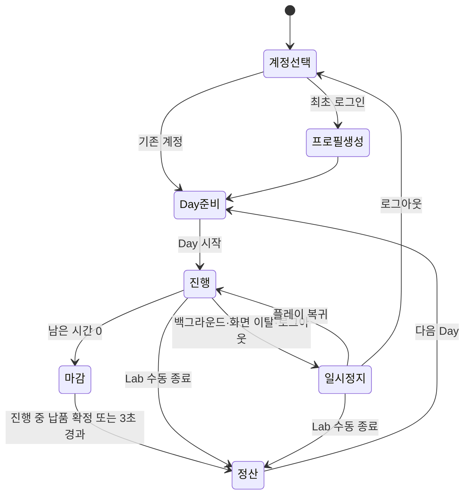

# Day·계정 기반 플레이 세션 실험안

> 관련 Issue: #207, #209, #210, #211, #212, #213, #214  
> 1차 선택안: B안 — 활성 플레이 시간 + 소프트 Day 종료  
> 메인 적용안: [DAY_SESSION_MAIN_APPLICATION.md](DAY_SESSION_MAIN_APPLICATION.md)

> **2026-10-09 작업대 교체 (Lab [#256](https://github.com/aigemro/dream-bike-garage-lab/issues/256))**: Day 진행 화면의 작업대를 C안(택배·여러 칸 부품)에서 **머지 코어 E v3**(가운데→바깥 예정 입고·인접 합성·연쇄 보너스·자동 장착/납품)로 바꿨다.
> - E안은 납품을 행동 시점에 확정하므로 시간 종료 시 마감 대기(최대 3초) 없이 바로 정산한다. Day 규칙의 `closing` 상태와 대기 상수는 다른 코어를 위해 남겨 둔다.
> - 작업대(보드·알바 체력·주문 진행)는 계정별 키 `dbg-lab-day-account-placement-v1:{playerId}`에 저장되어 다음 Day에 이어진다. 처음 연결할 때는 계정의 주문 순번에서 시작한다.
> - 납품 1건마다 `onOrderDelivered`를 한 번 호출해 코인·이해도·오늘 수입을 반영하고, 급여가 들어간 행동은 되돌리기를 막는다.
> - C안 택배 안내 오버레이는 E안 조작과 맞지 않아 Day 흐름에서 뺐다(첫 안내는 작업대 안내 문구).
> - 체력(E안)과 Day 시간(B안)이 함께 있는 이중 제한 구조이며, 플레이 제한 구조 결정은 메인에서 한다(적용안 3절).

## 1. 목표와 범위

게임 시작 전에 계정 세션을 만들고, 계정별 게임 프로필과 진행을 분리한다. 각 플레이 세션은 Day로 묶으며 실제 플레이 화면이 활성 상태일 때만 시간을 차감한다. Lab 기본 Day 길이는 빠른 반복 검증을 위한 10초이고, 헤더의 `Day 10초/1분/3분` 버튼으로 다음에 시작하는 Day 길이를 바꿔 실제 분량을 측정할 수 있다. 시간 종료 뒤에는 오늘 수입 정산을 확인하고 다음 Day를 명시적으로 시작한다.

이번 구현은 Lab 검증용이다. 실서비스 비밀번호, 토큰, 실제 Toss 사용자 정보는 저장하지 않는다. `BrowserMockAuthProvider`를 나중에 플랫폼 인증 어댑터로 교체할 수 있도록 인증 경계를 분리했다.

## 2. 모듈 구성

| 모듈 | 책임 | 의존 |
|---|---|---|
| `day-session-rules.ts` | Day 상태 전이·시간 차감·마감·정산 1회·복원 규칙 (순수 함수) | 없음 |
| `day-account-state.ts` | 계정 프로필·진행 저장, 계정별 컬렉션·성장 저장 (`KeyValueStorage` 주입) | Day 규칙, meta-progress 직렬화 |
| `auth-provider.ts` | Lab 테스트 계정 로그인 경계 | 없음 |
| `day-account-integration.ts` | 화면 전환·타이머 구동·일시정지·마감 대기 연결 | 위 모듈, 화면 프로토타입 |

Day 규칙은 머지 코어(보드 모델·부품 공급 방식)를 모른다. 플레이 화면과는 다음 세 가지만 주고받는다.

- `canAcceptPlayInput(day)`: 활성 상태에서만 공급·배치·머지 입력을 받는다.
- `recordOrderDelivery(day, reward)`: 머지 코어가 확정한 납품 1건을 Day 통계에 반영한다.
- 장착 연출 진행 여부(`onBusyChange`): 시간 종료 시점에 확정 직전인 납품을 기다릴지 판단한다.

## 3. 상태 흐름

```mermaid
stateDiagram-v2
    [*] --> 계정선택
    계정선택 --> 프로필생성: 최초 로그인
    계정선택 --> Day준비: 기존 계정
    프로필생성 --> Day준비
    Day준비 --> 진행: Day 시작
    진행 --> 일시정지: 백그라운드·화면 이탈·로그아웃
    일시정지 --> 진행: 플레이 복귀
    진행 --> 마감: 남은 시간 0
    마감 --> 정산: 진행 중 납품 확정 또는 3초 경과
    진행 --> 정산: Lab 수동 종료
    일시정지 --> 정산: Lab 수동 종료
    정산 --> Day준비: 다음 Day
    일시정지 --> 계정선택: 로그아웃
```

## 4. 데이터 계약

| 영역 | 주요 필드 | 소유·저장 단위 |
|---|---|---|
| 인증 세션 | `accountId`, `providerUserKey`, `displayLabel`, `provider` | 브라우저 세션, 테스트 계정 |
| 게임 프로필 | `playerId`, `accountId`, `nickname`, `garageName`, `createdAt` | 계정별 로컬 프로필 |
| 현재 Day | `dayNumber`, `status`, `durationMs`, `remainingMs`, `elapsedActiveMs`, `startedAt`, `pauseReason`, `ordersCompleted`, `earnings`, `endReason`, `settlementRevision` | 계정별 진행 |
| 진행 | `coins`, `orderIndex`, `completedOrders`, `tutorialDone`, `autoPlacement` | 계정별 진행 |
| 컬렉션·성장 | meta-progress의 `CollectionProgress`, `GrowthProgress` 그대로 | 계정별 키 (`…-collection-v1:{playerId}`, `…-growth-v1:{playerId}`) |
| 정산 기록 | Day, 종료 사유, 보상, 완료 주문 수, 시작·종료 시각, 활성 시간 | 계정별 append-only 이력 (최근 14일) |
| 설정 | BGM, SFX, 진동 | 계정별 진행 |

- `status`: `ready` → `active` ⇄ `paused` → `closing` → `settlement` → 다음 Day의 `ready`. 이전 버전 저장의 `completed`는 다음 Day 준비로 복원한다.
- `pauseReason`: `background`(앱 전환), `screen-navigation`(화면 이동), `logout`, `destroy`(데모 종료), `restore`(다시 열기).
- `durationMs`는 Day를 시작할 때 고정한다. 진행 중에 Lab 길이 설정을 바꿔도 현재 Day에는 영향이 없다. 이 필드가 없던 이전 저장은 기본 길이로 보정한다.
- 저장 키는 프로필 목록과 `playerId`별 슬롯으로 나눈다. 저장 시 revision을 증가시키고, Day 정산은 `settlementRevision`과 상태 검사, 같은 Day 번호 이력 검사로 중복을 막는다.

## 5. Day 규칙

| 안 | 시간 차감 | 장점 | 위험 | 1차 판단 |
|---|---|---|---|---|
| A 실제 시각 | 시작 뒤 앱 밖에서도 계속 | 마감 감각이 강함 | 전화·앱 전환에도 손실 발생 | 후속 비교 (#210) |
| B 활성 플레이 | 게임 플레이 화면이 활성일 때만 | 중단 복귀 안전, 테스트 해석 명확 | 긴장감이 A보다 약함 | **1차 권장·구현** |
| C 행동 횟수 | 머지·주문 등 행동 시 차감 | 디바이스 성능과 무관 | 규칙·밸런스 비용 증가 | 후속 비교 (#210) |

### 시간 종료 처리

1. 남은 시간이 0이 되면 Day는 `closing`(마감)이 되고, 플레이 화면은 새 택배 주문·개봉·배치·머지 입력을 받지 않는다. 택배 도착·자동 배치도 멈춘다.
2. 장착 연출이 진행 중이면(보드에서 부품은 이미 소비됨) 그 납품이 확정될 때까지 최대 3초 기다린 뒤 정산한다. 진행 중인 연출이 없으면 바로 정산한다.
3. `active`·`paused`·`closing` 중에 확정된 납품은 모두 그 Day 통계에 들어간다. 코인·누적 납품·이해도는 납품 확정 즉시 반영하므로 정산 시점과 무관하게 잃지 않는다.
4. 마감 중 화면을 떠나거나 앱이 백그라운드로 가면 기다리지 않고 정산한다. 마감 중 앱이 종료돼 `closing`으로 저장됐다면 다음 실행에서 바로 시간 종료 정산을 적용한다.
5. 시간 종료와 `Lab · Day 종료`가 겹쳐도 정산은 Day마다 한 번만 적용된다.

### 미완료 주문과 보드

Day 종료는 실패가 아니라 소프트 정산이다. 미완료 주문 번호는 다음 Day에 유지한다. 보드 처리는 Day 규칙이 아니라 **머지 코어의 저장 방식**이 결정한다. 현재 연결된 작업대(C안 택배 화면)는 보드를 저장하지 않으므로 다음 Day에 비워진다. D/E안처럼 체력으로 받은 부품을 쓰는 코어에서는 Day 사이에 보드를 유지하는 쪽이 자연스럽다(메인 적용안 6절).

Day 진행 중 자전거 한 대를 완성하면 별도 보상 화면으로 이동하지 않는다. 납품 보상과 오늘 수입은 완성 시점에 즉시 반영하고(다음 주문 전환 연출만 지연), 남은 보드 부품을 유지한 채 다음 자전거 주문을 바로 시작한다. 주문은 3종(ORDER_METAS)을 순서대로 순환하고, 납품 보상은 주문 메타의 급여를 따른다.

## 6. 자동 저장 시점

- 프로필 생성, Day 시작·일시정지·재개·마감·정산·다음 Day 준비
- 주문 완료와 보상 반영 (컬렉션 이해도 포함)
- 자전거 제작·강화·전시 변경 (코인 차감과 같은 처리에서 진행·컬렉션·성장을 함께 저장)
- 플레이 중 약 5초 간격 체크포인트
- `visibilitychange`로 백그라운드 전환
- 화면 이동(game·guide를 벗어나면 일시정지), 로그아웃, 컨트롤러 종료(일시정지 후 저장)
- 저장 실패(용량 초과·프라이빗 모드)는 예외 없이 메모리 진행을 유지하고 Lab 셸 라벨에 경고를 표시한다. 복구 시 손상된 정산 이력 요소는 버리고 숫자 필드는 보정한다.

새로고침 뒤 세션이 남아 있으면 해당 계정 슬롯을 읽는다. 저장된 Day가 `active`면 `paused`(다시 열기)로 복원하고 사용자가 PLAY로 돌아갈 때 재개한다. 백그라운드 이벤트 없이 앱이 종료된 경우에도 화면 밖에서 시간이 흐르지 않는다. 마지막 체크포인트 이후(최대 약 5초)의 활성 시간은 저장되지 않으며, 이 시간은 플레이어에게 유리한 쪽으로 돌려준다.

## 7. 이번 보완에서 수정한 문제

| 문제 | 영향 | 조치 |
|---|---|---|
| 성장 화면에 강화 처리 훅이 없음 | 강화하면 코인만 차감·저장되고 강화 단계는 화면을 나가면 사라짐 | 계정별 성장 저장과 `applyBikeUpgrade` 연결 |
| 컬렉션·성장이 계정별로 저장되지 않음 | 계정 진행 분리가 Day·코인에만 적용됨, 이해도·제작 미반영 | 계정별 키로 컬렉션·성장 저장, 납품 시 이해도 반영 |
| Day 모드 주문 순환이 `% 2` | 세 번째 주문이 나오지 않음 | `ORDERS.length` 기준으로 3종 순환 |
| 납품 보상이 하드코딩 | 주문 메타 급여와 어긋날 수 있음 | `orderMetaAt().reward` 사용 |
| 시간 종료 시 장착 연출 중인 납품 유실 | 보드에서 소비된 부품과 보상이 사라짐 | `closing` 단계에서 납품 확정까지 최대 3초 대기, 새 입력 잠금 |
| 저장된 `active` Day 복원 시 상태 보정 없음 | 문서와 달리 홈에 '영업 중'으로 남을 수 있음 | 복원 시 `paused`(다시 열기)로 보정 |
| HUD·홈 시간 표기가 `00:초` 고정 | 1분 이상 Day에서 `00:180`처럼 표시 | `mm:ss` 표기, 종료 임박 기준을 Day 길이 10%(최소 3초)로 변경 |
| Day 규칙이 컨트롤러 안에 섞여 있음 | 테스트 불가, 메인 이식 기준이 불명확 | 순수 규칙 모듈과 단위 테스트로 분리 |

## 8. 수용 시나리오

1. 계정 A 최초 로그인 시 프로필 생성 화면이 나오고, 생성 뒤 Day 1·2,480 코인으로 시작한다.
2. 홈 화면에는 현재 일차와 상태(영업 중·일시정지 사유·마감 중·정산)가 보이고, 플레이의 390×810 캔버스 내부에는 현재 일차·남은 시간(mm:ss)·남은 시간 막대·오늘 수입이 함께 보인다.
3. 플레이 화면에서만 남은 시간이 감소하고 백그라운드에서는 감소하지 않는다.
4. 자전거 납품 뒤 화면 전환 없이 보상과 오늘 수입, 해당 자전거 이해도가 반영되고 다음 주문이 바로 시작된다. 주문 3종이 순서대로 나온다.
5. 장착 연출 중에 시간이 끝나면 새 입력이 막히고, 그 납품이 확정된 뒤 정산 화면으로 넘어간다. 해당 납품은 오늘 수입에 포함된다.
6. 시간 종료와 `DAY 종료`를 반복 호출해도 같은 Day 정산이 두 번 생성되지 않는다.
7. 계정 A 진행 후 계정 B로 전환하면 초기 슬롯(Day·코인·컬렉션·성장)이 보이고, A 재로그인 시 A의 진행만 복원된다.
8. 진행 중 새로고침 후 같은 Day 번호·남은 시간·재화·주문·정산 이력이 복원되고, Day는 일시정지 상태로 열린다.
9. 다음 Day 시작 뒤 이전 정산 이력은 유지되고 현재 Day만 새 준비 상태가 된다.
10. 성장 화면에서 강화한 단계는 화면을 나갔다 와도, 새로고침해도 유지된다.

## 9. 후속 구현 경계

- 실제 Apps-in-Toss 로그인/토큰 검증과 서버 세션
- 서버 저장, 다중 기기 동기화, revision 기반 충돌 해결, 계정 탈퇴·데이터 삭제
- 머지 코어 보드 스냅샷 저장과 Day 사이 보드 이월 (머지 코어 채택 후)
- A안 실제 시각, C안 행동 예산을 같은 조건에서 비교하는 별도 Variant (#210)
- 타이머·로그아웃·정산의 자동화 E2E와 모바일 실기기 QA (#212)
