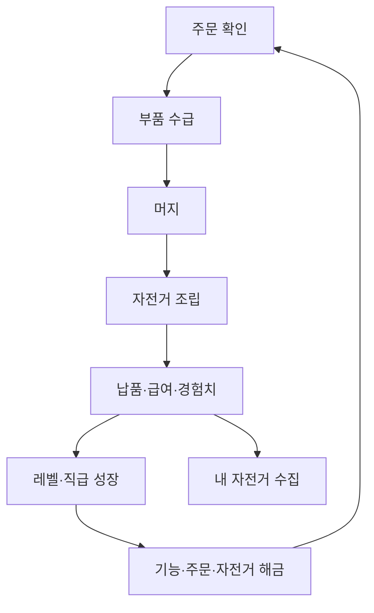

# 게임 필수 시스템 준비 로드맵

> 기준일: 2026-08-13  
> 상태: Lab 실험 계획 초안  
> 대상: Dream Bike Garage(오늘부터 자전거 부자)

이 문서는 머지·주문·조립·수집으로 구성된 현재 핵심 루프를 실제 게임의 장기 진행 구조로 연결하기 위해, 아직 독립적으로 검증되지 않은 필수 시스템과 저장소별 책임을 정리합니다.

수치는 확정 밸런스가 아니라 프로토타입과 플레이 테스트를 시작하기 위한 **초안 기준값**입니다. Lab에서 비교한 뒤 채택된 규칙만 메인 프로젝트의 최종 기획과 데이터에 반영합니다.

## 1. 현재 준비 상태

| 시스템 | 현재 준비 | 부족한 부분 | 다음 조치 |
|---|---|---|---|
| 머지 코어 | A/B/C 프로토타입과 비교 기준 존재 | 최종 방식 선정 및 난이도 연동 | 비교 결과 기록 후 메인 적용안 결정 |
| 주문·조립 | 자동 조립/직접 배치안 존재 | 주문 단계별 난이도와 해금 규칙 | 레벨 디자인 트랙과 공통 데이터로 연결 |
| 수집·Garage | 도감형/전시·성장형 후보 존재 | 획득 속도, 중복 가치, 장기 목표 | 컬렉션 경제와 직급 해금 실험 |
| 보상·성장 | 고정 급여/성과 보너스안 존재 | 경험치, 직급, 기능 해금, 경제 곡선 | Reward & Progression 범위 확장 |
| 레벨 디자인 | 기획 자료에 넓은 레벨 구간만 존재 | 초반 레벨별 주문·해금·목표 테이블 | 독립 트랙으로 설계·검증 |
| 직급·커리어 | 홈 화면에 Status/직급 위치만 존재 | 승진 조건과 실제 기능 변화 | 직급 성장 프로토타입 비교 |
| 난이도·경제 | 주문 예시와 보상 예시 존재 | 재화 공급/소비, 스태미너, 가격 곡선 | 시뮬레이션 가능한 데이터 테이블 작성 |
| 연출·피드백 | 기능별 기본 표시 중심 | 머지·조립·납품·승진의 손맛 | Feedback & Presentation 트랙 신설 |
| 디자인·오디오 | 저장소 경계 원칙만 일부 존재 | 원본·임시 자산·라이선스 관리 규칙 | 본 문서의 책임 경계 적용 |

## 2. 핵심 진행 구조

플레이어 레벨은 세부 진행 속도를, 직급은 큰 성장 단계와 기능 해금을 표현합니다. 컬렉션은 별도의 장기 목표로 유지하되 주문 플레이에서 얻은 급여와 해금 조건으로 연결합니다.

## 3. 레벨 디자인 원칙

1. 초반에는 한 번에 하나의 새 규칙만 공개합니다.
2. 첫 세션 안에 주문 → 머지 → 조립 → 납품 → 보상의 전체 루프를 경험하게 합니다.
3. 레벨 상승은 숫자 증가에 그치지 않고 새 주문, 부품, 화면 또는 선택지를 엽니다.
4. 일반 주문은 시간 초과만으로 실패시키지 않고 보너스 감소 등으로 완주 가능성을 보장합니다.
5. 난이도는 요구 부품 레벨, 종류 수, 보드 공간, 제한 조건을 동시에 급격히 올리지 않습니다.
6. 레벨 구간과 필요 경험치는 플레이 테스트 전까지 임시값으로 취급합니다.

### 장기 구간 초안

| 구간 | 플레이 단계 | 핵심 목표 | 주요 콘텐츠 |
|---|---|---|---|
| Lv.1~10 | 견습기 | 핵심 루프 학습과 첫 승진 | 기본 4부품, 로드 주문, 첫 Garage 자전거 |
| Lv.11~30 | 적응기 | 주문 선택과 공간 관리 | MTB 해금, 성과 보너스, 주문 2종 선택 |
| Lv.31~60 | 숙련기 | 상위 부품과 수집 확장 | 그래블, 고급 주문, Garage 전시 확장 |
| Lv.61~100 | 전문기 | 복합 조건과 성장 선택 | 특수 주문, 이벤트, 성장 경로 선택 |
| Lv.101+ | 마스터기 | 장기 컬렉션과 반복 도전 | 플래그십·한정 자전거, 고난도 주문 |

### 초반 10레벨 테이블

| Lv. | 플레이 목표 | 새로 공개되는 요소 | 주문 예시 | 완료/승급 기준 초안 |
|---:|---|---|---|---|
| 1 | 부품 생성과 같은 부품 머지 | 프레임 Lv.1~2 | 프레임 Lv.2 | 안내 머지 1회 |
| 2 | 휠셋 수급과 머지 | 휠셋 | 프레임 Lv.2 + 휠셋 Lv.1 | 첫 부품 조합 |
| 3 | 주문 목표 읽기 | 주문 진행률 | 기본 로드 주문 | 주문 1건 준비 |
| 4 | 조립과 납품 | 조립·납품·급여 | 기본 로드 완성 | 첫 주문 납품 |
| 5 | 여러 부품 우선순위 판단 | 구동계 | 로드 3부품 주문 | 주문 2건 누적 |
| 6 | 전체 기본 루프 완주 | 핸들바, 경험치 | 기본 4부품 로드 | 전체 루프 1회 |
| 7 | 상위 레벨 부품 제작 | Lv.3 요구 주문 | 프레임 Lv.3 주문 | Lv.3 부품 1개 |
| 8 | 공간 관리 학습 | 보드 막힘 안내·구제 | 혼합 레벨 주문 | 구제 기능 1회 체험 |
| 9 | 성과 보상 이해 | 시간/행동 보너스 | 보너스 로드 주문 | 보너스 조건 1회 달성 |
| 10 | 견습기 마무리 | 첫 승진, MTB 예고 | 승진 평가 주문 | 지정 주문 완료 |

초반 실제 목표 시간은 별도 테스트로 측정합니다. 현재 단계에서는 레벨당 고정 소요 시간을 확정하지 않습니다.

## 4. 직급·커리어 성장 초안

| 직급 | 권장 레벨 | 역할 인식 | 대표 해금 후보 | 승진 조건 초안 |
|---|---:|---|---|---|
| 견습 알바 | 1~10 | 기본 업무 학습 | 기본 로드 주문, 기본 Garage | 튜토리얼·승진 주문 완료 |
| 샵 스태프 | 11~30 | 일반 주문 독립 처리 | MTB, 주문 선택, 성과 보너스 | 누적 주문·컬렉션 조건 |
| 정비사 | 31~60 | 고급 부품 조립 | 그래블, 상위 부품, 전시 확장 | 고급 주문과 지정 자전거 획득 |
| 수석 미케닉 | 61~100 | 특수 주문 책임 | 특수 주문, 성장 선택, 이벤트 | 품질·성과 목표 동시 달성 |
| 매니저 | 101~150 | Garage 운영 확장 | 복수 주문, 전시 테마, 고급 고객 | 장기 목표와 컬렉션 세트 |
| 드림 바이크 샵 오너 | 151+ | 최종 소유·수집 단계 | 플래그십·한정 자전거 | 시즌/컬렉션 목표 |

### 직급 설계 규칙

- 직급은 레벨 이름만 바꾸는 장식이 아니라 최소 하나의 기능을 해금합니다.
- 승진 조건은 레벨만 요구하지 않고 대표 주문 또는 컬렉션 목표를 함께 둡니다.
- 직급 보상은 영구 기능 해금 위주로 하고 일회성 재화만 지급하지 않습니다.
- 명칭과 세계관 표현은 메인 프로젝트에서 최종 확정합니다.

## 5. 난이도와 경제 테이블

### 주문 난이도 축

| 축 | 쉬움 | 보통 | 어려움 | 주의점 |
|---|---|---|---|---|
| 부품 종류 수 | 1~2종 | 3종 | 4종 이상 | 새 종류와 높은 레벨을 동시에 추가하지 않음 |
| 요구 부품 레벨 | Lv.1~2 | Lv.2~3 | Lv.3 이상 | 머지 횟수 증가 폭 측정 |
| 공간 압박 | 넉넉함 | 일부 정리 필요 | 구제 판단 필요 | 운으로만 막히지 않게 함 |
| 시간 조건 | 없음 | 보너스 시간 | 엄격한 보너스 | 일반 주문 완주 자체는 허용 |
| 주문 선택 | 단일 | 2개 중 선택 | 조건이 다른 복수 주문 | 화면 복잡도와 함께 검증 |
| 특수 조건 | 없음 | 특정 품질 | 복합 조건 | 한 번에 하나씩 학습 |

### 경제 항목

| 항목 | 획득처 | 사용처 | Lab에서 확인할 지표 |
|---|---|---|---|
| 경험치 | 주문 납품, 첫 수집, 승진 과제 | 플레이어 레벨 | 레벨당 주문 수, 성장 정체 구간 |
| 급여/코인 | 기본 급여, 성과 보너스 | 자전거 구매, Garage 확장 | 수입 대비 가격, 구매까지 소요 주문 수 |
| 스태미너 | 시간 회복, 보상, 선택적 광고 후보 | 주문/부품 수급 시작 | 세션 길이, 강제 중단감 |
| 컬렉션 진행 | 자전거 구매·완성·특수 보상 | 도감 및 해금 조건 | 첫 획득 시간, 중복 가치 |
| 승진 점수/조건 | 지정 주문과 목표 달성 | 직급 승진 | 레벨과의 중복감, 목표 명확성 |

스태미너와 광고·결제는 MVP 필수로 확정하지 않습니다. 핵심 루프가 재미있는지 먼저 검증하고, 필요할 때 별도의 Monetization 실험과 연결합니다.

## 6. Lab 신규·확장 트랙 계획

| 우선순위 | 트랙 | Prototype 후보 | 공통 결과물 |
|---|---|---|---|
| P0 | Level Design & Unlock | A: 레벨 선형 해금 / B: 챕터·지역 해금 / C: 직급·Garage 결합 | 초반 10레벨 플레이 결과, 해금 이해도 |
| P0 | Career Rank | A: 레벨 자동 승진 / B: 승진 과제 / C: 레벨+컬렉션 복합 | 승진 동기, 기능 해금 체감 |
| P0 | Difficulty & Economy | A: 예측 가능한 고정 곡선 / B: 성과 기반 곡선 / C: 주문 선택형 | 주문 완료 시간, 재화 수급·소비 표 |
| P1 | Feedback & Presentation | A: 빠른 캐주얼 / B: 기계적 조립감 / C: 큰 보상 강조 | 동일 이벤트별 영상·관찰 결과 |
| P1 | Audio Integration | A: 최소 UI 사운드 / B: 부품 재질 차등 / C: 보상 레이어 강화 | 음량·중복 재생·WebView 복귀 검증 |
| P2 | Live/Repeat Content | 일일 주문 / 이벤트 / 컬렉션 세트 | 반복 피로와 재방문 동기 |

기존 Reward & Progression 트랙은 즉시 보상과 성장 선택을 담당하고, Level Design은 콘텐츠 공개 순서, Career Rank는 큰 성장 단계, Difficulty & Economy는 수치 곡선을 담당합니다.

## 7. 연출 검증 범위

연출은 조작 결과를 이해시키고 성취감을 만드는 게임 기능이므로 Lab에서 프로토타입을 비교합니다.

| 이벤트 | 최소 피드백 | 비교할 연출 후보 | 확인 지표 |
|---|---|---|---|
| 부품 선택 | 외곽선·상태 표시 | 밝기, 펄스, 고스트 | 선택 상태 오인 |
| 머지 성공 | 결과 강조 | 확대·스냅·파티클·진동 후보 | 결과 인지 시간, 반복 피로 |
| 상위 부품 생성 | 레벨 상승 표시 | 빛 기둥, 배지, 짧은 정지 | 희소성·성취감 |
| 부품 장착 | 슬롯 반응 | 흡착, 볼트 체결, 진행률 변화 | 조립감 |
| 자전거 완성 | 완성차 공개 | 조명, 카메라 이동, 부품 순차 점등 | 완성 성취감 |
| 주문 납품 | 보상 전환 | 차량 이동, 고객 반응, 코인 이동 | 보상 연결 이해 |
| 레벨업·승진 | 상태 변화 | 배지, 명칭 전환, 기능 해금 카드 | 해금 인지 |
| 실패·오입력 | 원인 표시 | 흔들림, 색상, 짧은 효과음 | 좌절감과 복구 이해 |

멀미 가능성이 있는 큰 흔들림·섬광은 강도를 제한하고, 진동·사운드·화면 흔들림을 사용자가 끌 수 있도록 확장 가능성을 유지합니다.

## 8. 디자인·음악·효과음 관리 경계

| 자산/결정 | 메인 프로젝트 | Lab 프로젝트 |
|---|---|---|
| 게임 아트 방향과 최종 스타일 | 최종 결정·문서화 | 비교용 임시 표현 |
| 자전거·캐릭터·배경 원본 | 원본과 최종 내보내기 관리 | 필요한 테스트용 축소본/대체물 |
| UI 디자인 시스템 | 색상·타이포·컴포넌트 최종 기준 | 배치·가독성·입력 방식 검증 |
| BGM·효과음 원본 | 원본, 제작본, 라이선스·출처 관리 | 임시 음원 또는 테스트용 내보내기 |
| 연출 규칙 | 채택된 최종 규칙 | A/B/C 타이밍·강도 비교 |
| 오디오 기술 | 최종 적용 설정 | Web Audio, 중복 재생, 포커스·복귀 검증 |

### 자산 원칙

1. 최종 디자인과 오디오 원본의 단일 기준은 메인 프로젝트로 둡니다.
2. Lab에는 실험 재현에 필요한 파일만 두고 원본 작업 파일을 중복 관리하지 않습니다.
3. 임시 자산은 파일명 또는 메타데이터로 placeholder임을 표시합니다.
4. 외부 자산은 출처, 라이선스, 수정 가능 범위를 메인 프로젝트에서 기록합니다.
5. Lab에서 채택된 연출 수치와 재생 규칙은 결정 문서로 남긴 뒤 메인에서 재구현합니다.

## 9. 단계별 실행 계획

| 단계 | 작업 | 완료 조건 |
|---:|---|---|
| 1 | 본 문서와 용어 검토 | 레벨·직급·해금의 역할 구분 합의 |
| 2 | 신규 상위 트랙 Issue 생성 | 각 트랙 질문·공통 조건·평가 기준 작성 |
| 3 | 초반 10레벨 데이터 프로토타입 | 같은 핵심 루프로 1~10 진행 가능 |
| 4 | 직급 A/B/C 프로토타입 | 승진과 기능 해금 흐름 비교 가능 |
| 5 | 난이도·경제 측정 | 주문 수, 완료 시간, 재화 흐름 기록 |
| 6 | 연출 A/B/C 프로토타입 | 동일 이벤트를 독립 설정으로 비교 |
| 7 | 채택안 정리 | Lab 결정 기록과 메인 적용 Issue 연결 |

## 10. 아직 확정하지 않는 항목

- 최종 레벨 상한과 레벨별 필요 경험치
- 직급의 최종 명칭과 개수
- 주문별 최종 급여와 자전거 가격
- 스태미너·광고·결제 적용 여부
- 브랜드 실명과 실제 모델 사용 범위
- 최종 아트·음악·효과음
- 라이브 이벤트와 시즌 운영

이 항목들은 기획 결정, 라이선스 확인 또는 플레이 테스트 근거가 필요합니다. Lab에서는 선택지를 비교하되 확정된 것처럼 구현하지 않습니다.

## 11. 참고 기반

- 글로벌 자전거 브랜드 게임 마케팅 기획서: 머지 진화, 넓은 레벨 구간, 스태미너와 장기 성장 아이디어 참고
- Dream Bike Garage 머지게임 시스템 설계안: 주문 → 부품 수급 → 머지 → 조립 → 납품 → 급여 → 수집의 현재 핵심 루프 참고
- [실험 운영 가이드](EXPERIMENT_GUIDE.md)
- [기술 스택 및 검증 기준](TECH_STACK.md)
- [메인 프로젝트와 Lab 역할 경계](PROJECT_BOUNDARY.md)

기획서의 브랜드·레벨·과금 제안은 그대로 확정하지 않고 현재 Dream Bike Garage의 캐주얼 주문 조립과 자전거 수집 방향에 맞춰 다시 검증합니다.
