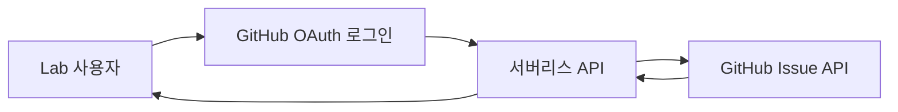

# GitHub Issue 의견 연동 운영 및 확장 방안

> 현재 적용 범위: GitHub Pages 정적 사이트  
> 대상 저장소: `aigemro/dream-bike-garage-lab`

## 1. 현재 운영 방식

각 Lab 방안은 하나의 GitHub Issue와 연결합니다. 방안 상세 화면에서는 공개 GitHub API로 해당 Issue의 댓글을 읽고, 의견을 등록할 때는 사용자를 GitHub Issue 화면으로 이동시킵니다.

1. 사용자가 트랙에서 방안 카드를 선택합니다.
2. 방안 상세 화면에서 Markdown 구현 설명과 Issue 댓글을 확인합니다.
3. 의견을 입력하고 `GitHub에서 댓글 등록`을 누릅니다.
4. 입력 내용이 클립보드에 복사되고 연결된 Issue가 새 창으로 열립니다.
5. 사용자가 GitHub에서 로그인한 뒤 내용을 붙여넣어 등록합니다.

이 방식은 별도 서버가 필요 없고 정적 페이지에 인증 토큰을 노출하지 않습니다. 댓글 작성 과정에서 GitHub 화면으로 이동해야 하는 점은 현재 단계의 의도된 제약입니다.

## 2. 방안과 Issue 연결 규칙

- 각 방안 데이터에 `issueNumber`를 명시합니다.
- 댓글 조회와 등록 이동은 같은 Issue 번호를 사용합니다.
- 방안을 새로 만들 때 먼저 방안 Issue를 만들고 화면 데이터에 번호를 연결합니다.
- 트랙 Issue와 방안 Issue를 구분하며, 구현 의견은 해당 방안 Issue에 남깁니다.
- 방안 설명은 `docs/variants/*.md`에서 관리합니다.
- Issue가 닫혀 있으면 의견 수렴 또는 구현 진행 전에 다시 엽니다.

## 3. 현재 보안 원칙

- Personal Access Token, OAuth Client Secret, GitHub App Private Key를 브라우저 코드나 저장소에 넣지 않습니다.
- 공개 댓글 조회에는 인증 없는 GitHub REST API만 사용합니다.
- API 호출 실패, 요청 제한, 댓글 없음 상태를 화면에서 구분해 안내합니다.
- GitHub에서 가져온 댓글은 신뢰할 수 없는 사용자 입력으로 취급하고 HTML을 직접 실행하지 않습니다.

## 4. 추후 확장: GitHub OAuth + 서버리스 API

Lab 화면 안에서 기존 방안 Issue에 댓글을 직접 등록해야 할 때 적용하는 2단계 방안입니다.

### 권장 구성

| 영역 | 역할 |
|---|---|
| GitHub OAuth 또는 GitHub App | 사용자 로그인과 최소 댓글 작성 권한 승인 |
| 서버리스 API | 인증 코드 교환, 토큰 보호, 댓글 등록 요청 검증 |
| GitHub REST API | 지정된 저장소와 Issue에 댓글 생성 |
| Lab 프런트엔드 | 로그인 상태, 댓글 입력·등록 결과, 오류 표시 |

GitHub App을 사용할 수 있다면 저장소와 권한 범위를 더 세밀하게 제한할 수 있으므로 우선 검토합니다. OAuth App을 선택해도 Client Secret과 액세스 토큰은 반드시 서버리스 환경에서만 취급합니다.

### 예상 API 흐름

1. 사용자가 Lab에서 `GitHub 로그인`을 선택합니다.
2. GitHub 승인 화면을 거쳐 콜백 URL로 돌아옵니다.
3. 서버리스 API가 인증 코드를 토큰으로 교환하고 안전한 세션을 만듭니다.
4. 프런트엔드가 `POST /api/issues/{issueNumber}/comments`로 댓글 본문을 전송합니다.
5. 서버리스 API가 저장소, Issue 번호, 본문 길이와 사용자 권한을 검증합니다.
6. 서버리스 API가 GitHub REST API에 댓글을 등록합니다.
7. 성공하면 댓글 목록을 다시 조회해 화면을 갱신합니다.

### 서버리스 API 필수 검증

- 허용 저장소를 `aigemro/dream-bike-garage-lab`으로 고정
- 화면 데이터에 등록된 Issue 번호만 허용
- 빈 댓글, 최대 길이 초과, 과도한 연속 요청 차단
- CSRF 방어를 위한 `state` 값과 안전한 세션 쿠키 사용
- 비밀값은 배포 환경 변수 또는 Secret Store에만 저장
- GitHub API 오류와 요청 제한을 사용자 메시지로 변환
- 인증·오류 로그에 토큰과 댓글 본문을 남기지 않음

## 5. 도입 시점과 완료 기준

현재 방식에서 GitHub 이동이 실제 검토 흐름의 반복적인 불편으로 확인될 때 별도 Issue로 구현합니다. 도입 전에는 배포 서비스, 콜백 URL, GitHub App/OAuth App 소유 주체와 운영 비용을 먼저 결정합니다.

완료 기준은 다음과 같습니다.

- Lab에서 GitHub 로그인과 로그아웃이 가능함
- 기존 방안 Issue에 화면 이탈 없이 댓글을 등록함
- 권한 없는 저장소와 Issue에는 요청할 수 없음
- 인증 실패, 세션 만료, 요청 제한을 복구 가능한 방식으로 안내함
- 토큰과 비밀값이 브라우저 번들, 로그, 저장소에 노출되지 않음

