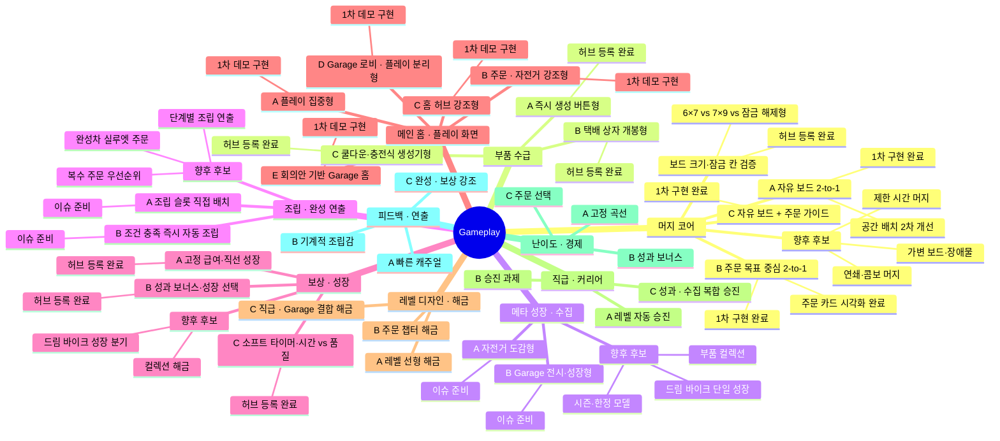
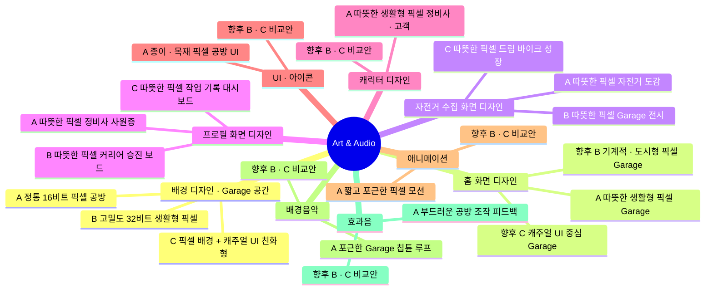
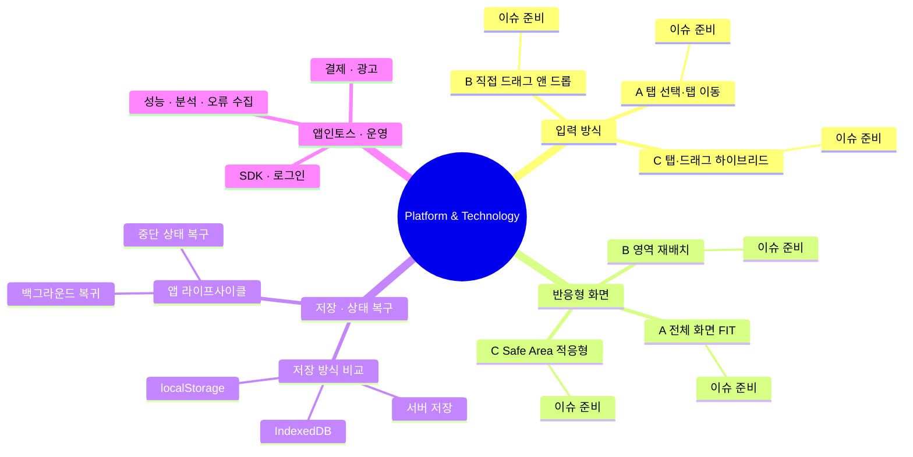
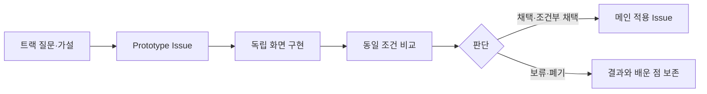

# Dream Bike Garage Lab 프로토타입 지도

> 기준일: 2026-08-15
> 대상: `aigemro/dream-bike-garage-lab`

이 문서는 Dream Bike Garage Lab에서 진행 중인 기술 실험을 **트랙 → 프로토타입 → 비교·결정** 구조로 한눈에 확인하기 위한 공식 지도입니다. 새로운 방안이 생기면 기존 안을 덮어쓰지 않고 해당 트랙 아래에 Prototype을 추가합니다.

## 1. 기준 설계와 범위

현재 MVP 기준은 **고객 주문 → 온라인 부품 주문 → 택배 도착 → 동일 부품 2-to-1 머지 → 자전거 조립 → 납품·급여 → 내 자전거 수집**입니다.

- 현재 핵심: 캐주얼 머지, 주문 조립, 완성차 수집
- Lab 역할: 여러 구현안을 같은 조건으로 만들어 비교하고 선택 근거를 남김
- 메인 역할: Lab에서 선택한 결과를 기획·설계 기준에 맞춰 최종 적용
- 향후 확장: 브랜드 협업, 매치3, 레이스, 경영, 과금·광고는 MVP 검증 이후 별도 트랙으로 검토

## 2. 전체 실험 지도

```mermaid
flowchart TB
    LAB["Dream Bike Garage Lab"]
    LAB --> CORE["MVP Core Play<br/>한 판의 직접 플레이"]
    LAB --> META["Meta Progression<br/>보상 이후 장기 성장"]
    LAB --> ART["Art & Audio<br/>시각·청각 표현과 에셋"]
    LAB --> PLATFORM["Platform & Technology<br/>실행 환경과 기술 안정성"]
    LAB --> INTEGRATION["Release Integration<br/>출시 수직 슬라이스"]

    CORE --> MERGE["머지 코어"]
    CORE --> SUPPLY["부품 수급"]
    CORE --> ORDER["주문 목표 · 반복"]
    CORE --> ASSEMBLY["조립 · 완성 연출"]
    CORE --> RECOVERY["보드 막힘 · 복구"]
    META --> COLLECTION["수집"]
    META --> REWARD["보상 · 성장"]
    META --> HOME["메인 홈 · 플레이 화면"]
    META --> LEVEL["레벨 디자인 · 해금"]
    META --> CAREER["직급 · 커리어"]
    META --> ECONOMY["난이도 · 경제"]
    ART --> BACKGROUND["배경 디자인 · Garage 공간"]
    ART --> CHARACTER["캐릭터 디자인"]
    ART --> UIART["UI · 아이콘"]
    ART --> ANIMATION["애니메이션"]
    ART --> BGM["배경음악"]
    ART --> SFX["효과음"]
    ART --> HOMEDESIGN["홈 화면 디자인"]
    ART --> COLLECTIONDESIGN["자전거 수집 화면 디자인"]
    ART --> PROFILEDESIGN["프로필 화면 디자인"]
    ART --> FEEDBACK["피드백 · 연출"]

    PLATFORM --> INPUT["입력 방식"]
    PLATFORM --> RESPONSIVE["반응형 화면"]
    PLATFORM --> SAVE["저장 · 상태 복구"]
    PLATFORM --> TOSS["앱인토스 · 운영"]
    INTEGRATION --> MVP["MVP 핵심 루프 통합"]
```

세부 분류 기준과 현재 통합 선택안은 [트랙 분류 운영안](TRACK_CLASSIFICATION.md)을 따릅니다.

## 3. MVP 핵심 플레이·메타 성장 프로토타입

## 4. Art & Audio 프로토타입

Art & Audio는 게임 규칙이나 플랫폼 기술이 아니라, 동일한 게임 상태를 어떤 시각·청각 언어로 전달할지 비교하는 상위 분류입니다. 배경·캐릭터·UI·애니메이션·음악·효과음을 각각 독립 트랙으로 관리합니다.

## 5. Platform & Technology 프로토타입

## 6. 현재 진행 현황

| 분류 | 트랙 | Prototype / 작업 | 현재 상태 | 다음 확인 | 관련 항목 |
|---|---|---|---|---|---|
| MVP Core Play | 머지 코어 | A: 자유 보드 2-to-1 | 개발 중 | 웹브라우저 중심 레이아웃 PR 검토 및 플레이 테스트 | [#10](https://github.com/aigemro/dream-bike-garage-lab/issues/10), [PR #30](https://github.com/aigemro/dream-bike-garage-lab/pull/30), [PR #40](https://github.com/aigemro/dream-bike-garage-lab/pull/40) |
| MVP Core Play | 머지 코어 | B: 주문 목표 중심 2-to-1 | 검토 준비 | 주문 카드 시각화 후 A/C와 목표 이해도 비교 | [#13](https://github.com/aigemro/dream-bike-garage-lab/issues/13), [PR #31](https://github.com/aigemro/dream-bike-garage-lab/pull/31) |
| MVP Core Play | 머지 코어 | C: 자유 보드 + 주문 가이드 | 검토 준비 | 가이드 강도와 자유도의 균형 비교 | [#25](https://github.com/aigemro/dream-bike-garage-lab/issues/25), [PR #26](https://github.com/aigemro/dream-bike-garage-lab/pull/26) |
| MVP Core Play | 머지 코어 | 보드 크기·잠금 칸 검증 | 준비 (허브 등록) | 비교 데모 구현, 메인 8/13(M0) 보드 크기 결정 지원 | [#74](https://github.com/aigemro/dream-bike-garage-lab/issues/74) |
| MVP Core Play | 부품 수급 | A: 즉시 생성 버튼형 | 개발 중 (1차 데모) | 동일 조건(5×4 보드, Lv.3 ×2 목표)에서 B/C와 템포 비교 플레이 테스트 | [#70](https://github.com/aigemro/dream-bike-garage-lab/issues/70), [#71](https://github.com/aigemro/dream-bike-garage-lab/issues/71) |
| MVP Core Play | 부품 수급 | B: 택배 상자 개봉형 | 개발 중 (1차 데모) | 개봉 연출의 만족감과 템포 저하 비교 플레이 테스트 | [#72](https://github.com/aigemro/dream-bike-garage-lab/issues/72) |
| MVP Core Play | 부품 수급 | C: 쿨다운·충전식 생성기형 | 개발 중 (1차 데모) | 장르 표준 생성기의 주문 단위 세션 부합 플레이 테스트 | [#73](https://github.com/aigemro/dream-bike-garage-lab/issues/73) |
| Meta Progression | 수집 | A: 자전거 도감형 | 준비 | 최소 도감 화면과 획득 피드백 정의 | [#14](https://github.com/aigemro/dream-bike-garage-lab/issues/14) |
| Meta Progression | 수집 | B: Garage 전시·성장형 | 준비 | 전시와 성장 중 핵심 소유감 검증 | [#12](https://github.com/aigemro/dream-bike-garage-lab/issues/12) |
| MVP Core Play | 조립·완성 연출 | A: 조건 충족 즉시 자동 조립 | 검토 준비 | 캐주얼 템포와 조립 성취감 비교 | [#17](https://github.com/aigemro/dream-bike-garage-lab/issues/17) |
| MVP Core Play | 조립·완성 연출 | B: 조립 슬롯 직접 배치 | 검토 준비 | 직접 배치의 조립감과 추가 피로 비교 | [#18](https://github.com/aigemro/dream-bike-garage-lab/issues/18) |
| Meta Progression | 보상·성장 | A/B | 준비 (허브 등록) | 고정 급여와 성과 보너스의 반복 동기 비교 데모 구현 | [#20](https://github.com/aigemro/dream-bike-garage-lab/issues/20), [#21](https://github.com/aigemro/dream-bike-garage-lab/issues/21) |
| Meta Progression | 보상·성장 | C: 소프트 타이머·시간 vs 품질 | 준비 (허브 등록) | 시간 보너스 vs 품질 보너스 선택의 재미 검증 (차별화 지점) 데모 구현 | [#75](https://github.com/aigemro/dream-bike-garage-lab/issues/75) |
| Meta Progression | 메인 홈·플레이 화면 | A/B/C/D/E | 검토 준비 | 통합형 3안, 일반 Garage D안, 회의 배치 기반 Garage E안 비교 | [#87](https://github.com/aigemro/dream-bike-garage-lab/issues/87), [#95](https://github.com/aigemro/dream-bike-garage-lab/issues/95), [#96](https://github.com/aigemro/dream-bike-garage-lab/issues/96), [#97](https://github.com/aigemro/dream-bike-garage-lab/issues/97), [#100](https://github.com/aigemro/dream-bike-garage-lab/issues/100), [#102](https://github.com/aigemro/dream-bike-garage-lab/issues/102) |
| Meta Progression | 레벨 디자인·해금 | A/B/C | 개발 중 | 초반 10레벨 공개 순서와 진행 속도 비교 | [#106](https://github.com/aigemro/dream-bike-garage-lab/issues/106) |
| Meta Progression | 직급·커리어 | A/B/C | 개발 중 | 자동·과제·복합 승진 조건 비교 | [#107](https://github.com/aigemro/dream-bike-garage-lab/issues/107) |
| Meta Progression | 난이도·경제 | A/B/C | 개발 중 | 주문 시간·행동·수입·소비 측정 | [#108](https://github.com/aigemro/dream-bike-garage-lab/issues/108) |
| Art & Audio | 피드백·연출 | A/B/C | 개발 중 | 동일 이벤트의 길이·강도·피로 비교 | [#109](https://github.com/aigemro/dream-bike-garage-lab/issues/109) |
| MVP Core Play | 주문 목표·반복 플레이 | A: 순환 주문 세트 | 개발 중 (1차 데모) | 초기 3종 이후 변형 주문의 재플레이 동기 검증 | [#144](https://github.com/aigemro/dream-bike-garage-lab/issues/144) |
| MVP Core Play | 보드 막힘·복구 | A: 1회 무료 정리 | 개발 중 (1차 데모) | 막힘 감지 후 손실감·복구 행동 수·정상 플레이 복귀 검증 | [#145](https://github.com/aigemro/dream-bike-garage-lab/issues/145) |
| Art & Audio | 배경 디자인·Garage 공간 | A/B/C | 검토 준비 (시안·허브 등록) | 390×810 주문·PLAY UI 오버레이 후 감성·가독성·제작 비용 비교 | [#119](https://github.com/aigemro/dream-bike-garage-lab/issues/119), [#120](https://github.com/aigemro/dream-bike-garage-lab/issues/120), [#121](https://github.com/aigemro/dream-bike-garage-lab/issues/121), [#122](https://github.com/aigemro/dream-bike-garage-lab/issues/122) |
| Art & Audio | 홈 화면 디자인 | A: 따뜻한 생활형 픽셀 Garage | 개발 중 (1차 데모) | 회의안 E 구조 기준 3초 인지·UI 가독성·Garage 소유감 검토 후 B/C안 추가 | [#130](https://github.com/aigemro/dream-bike-garage-lab/issues/130) |
| Art & Audio | 자전거 수집 화면 디자인 | A/B/C: 도감·전시·드림 바이크 | 개발 중 (1차 데모) | 홈 A안 자전거 탭 진입 기준 24종 가독성·소유감·성장 동기 비교 | [#147](https://github.com/aigemro/dream-bike-garage-lab/issues/147), [#148](https://github.com/aigemro/dream-bike-garage-lab/issues/148), [#149](https://github.com/aigemro/dream-bike-garage-lab/issues/149), [#150](https://github.com/aigemro/dream-bike-garage-lab/issues/150) |
| Art & Audio | 프로필 화면 디자인 | A/B/C: 사원증·승진 보드·기록 대시보드 | 개발 중 (1차 데모) | 홈 A안 프로필 탭 진입 기준 정보 3요소 가독성·승진 동기 연결 비교 | [#157](https://github.com/aigemro/dream-bike-garage-lab/issues/157), [#158](https://github.com/aigemro/dream-bike-garage-lab/issues/158), [#159](https://github.com/aigemro/dream-bike-garage-lab/issues/159), [#160](https://github.com/aigemro/dream-bike-garage-lab/issues/160), [검토](PROFILE_SCREEN_DESIGN_REVIEW.md) |
| Art & Audio | 캐릭터 디자인·표현 방향 | A: 따뜻한 생활형 픽셀 정비사·고객 | 개발 중 (1차 데모) | 역할 실루엣·필드/초상화 연결·3단계 감정 비교 | [#125](https://github.com/aigemro/dream-bike-garage-lab/issues/125), [#133](https://github.com/aigemro/dream-bike-garage-lab/issues/133) |
| Art & Audio | UI·아이콘 아트 방향 | A: 종이·목재 픽셀 공방 UI | 개발 중 (1차 데모) | 주문·부품·재화·READY/부족/잠금 상태 가독성 비교 | [#126](https://github.com/aigemro/dream-bike-garage-lab/issues/126), [#134](https://github.com/aigemro/dream-bike-garage-lab/issues/134) |
| Art & Audio | 애니메이션·모션 표현 방향 | A: 짧고 포근한 픽셀 모션 | 개발 중 (1차 데모) | 0.4초 이하 머지·장착·완성 인지와 반복 피로 비교 | [#127](https://github.com/aigemro/dream-bike-garage-lab/issues/127), [#135](https://github.com/aigemro/dream-bike-garage-lab/issues/135) |
| Art & Audio | 배경음악·공간 분위기 | A: 포근한 Garage 칩튠 루프 | 개발 중 (1차 데모) | HOME/WORK 변주·전환·반복 피로·오디오 생명주기 검증 | [#128](https://github.com/aigemro/dream-bike-garage-lab/issues/128), [#136](https://github.com/aigemro/dream-bike-garage-lab/issues/136) |
| Art & Audio | 효과음·조작 피드백 | A: 부드러운 공방 조작 피드백 | 개발 중 (1차 데모) | 핵심 행동 6종 구분감·조립감·연속 입력 피로 검증 | [#129](https://github.com/aigemro/dream-bike-garage-lab/issues/129), [#137](https://github.com/aigemro/dream-bike-garage-lab/issues/137) |
| Release Integration | MVP 핵심 루프 통합 | 선택안 기능 수직 슬라이스 | 개발 중 (1차 데모) | 주문 3종 완주·상태 복구·진행 막힘 여부 검증 | [#113](https://github.com/aigemro/dream-bike-garage-lab/issues/113), [#114](https://github.com/aigemro/dream-bike-garage-lab/issues/114), [통합 검토](MVP_CORE_LOOP_INTEGRATION_REVIEW.md) |
| Platform | 입력 방식 | A/B/C | 허브 반영 중 | 탭·드래그·하이브리드를 같은 보드에서 비교 | [#33](https://github.com/aigemro/dream-bike-garage-lab/issues/33), [PR #39](https://github.com/aigemro/dream-bike-garage-lab/pull/39) |
| Platform | 반응형 화면 | A/B/C | 허브 반영 중 | 모바일·태블릿·웹브라우저 조건별 비교 | [#4](https://github.com/aigemro/dream-bike-garage-lab/issues/4), [PR #39](https://github.com/aigemro/dream-bike-garage-lab/pull/39) |
| Platform | 저장·복구 | 방식 후보 | 준비 | MVP 저장 범위와 WebView 복구 조건 정의 | [#3](https://github.com/aigemro/dream-bike-garage-lab/issues/3), [#5](https://github.com/aigemro/dream-bike-garage-lab/issues/5) |
| Platform | 앱인토스·운영 | 기반 이슈 | 준비 | SDK·로그인 이후 결제/광고/운영 순차 검증 | [#6](https://github.com/aigemro/dream-bike-garage-lab/issues/6), [#7](https://github.com/aigemro/dream-bike-garage-lab/issues/7), [#8](https://github.com/aigemro/dream-bike-garage-lab/issues/8) |

상태는 `아이디어 → 준비 → 개발 중 → 검토 준비 → 검토 → 완료`로 관리하며, 결과는 `채택 / 조건부 채택 / 보류 / 폐기`로 별도 기록합니다.

## 7. 실험에서 메인 적용까지

## 8. 신규 트랙·프로토타입 추가 규칙

1. 기존 트랙의 해결 방안이면 해당 트랙 아래 Prototype을 추가합니다.
2. 검증 질문과 평가 기준이 다르면 새 트랙을 만듭니다.
3. 같은 트랙은 초기 보드·주문·데이터를 가능한 한 동일하게 유지합니다.
4. 구현 완료와 채택을 구분합니다. 실행 가능하더라도 비교 전에는 채택하지 않습니다.
5. 실험 결과에는 측정값, 관찰, 장점, 한계, 메인 적용 여부를 남깁니다.
6. 현재 MVP 밖의 브랜드·매치3·레이스·경영·과금 확장은 핵심 루프가 검증된 뒤 별도 트랙으로 승격합니다.

## 9. 설계 자료 해석 기준

- `Dream Bike Garage 머지게임 시스템 설계안`은 현재 핵심 루프와 MVP 범위의 기준 자료로 사용합니다.
- 기존 `글로벌 자전거 브랜드 매치3·머지 게임 마케팅 기획서`의 브랜드, 매치3, 레이스, O2O, 과금 아이디어는 폐기하지 않되 현재 MVP와 섞지 않고 향후 확장 후보로 보관합니다.
- 실제 브랜드명과 모델은 라이선스 또는 협업이 확정된 뒤 적용합니다.

---

관련 문서: [실험 운영 가이드](EXPERIMENT_GUIDE.md) · [기술 구성](TECH_STACK.md) · [프로젝트 역할 경계](PROJECT_BOUNDARY.md)
