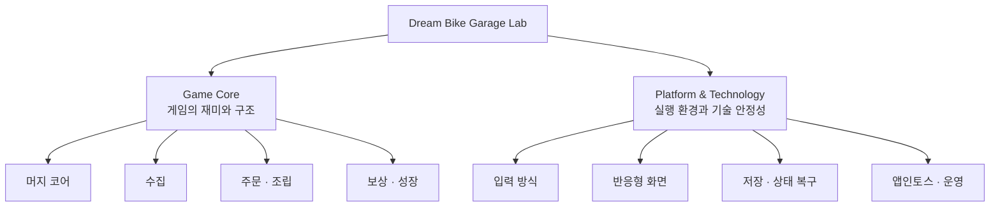
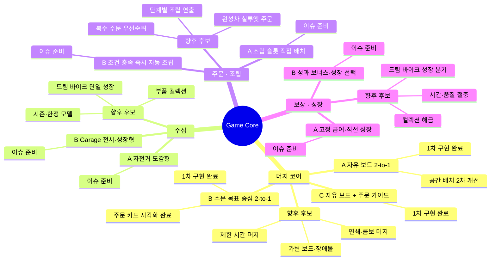
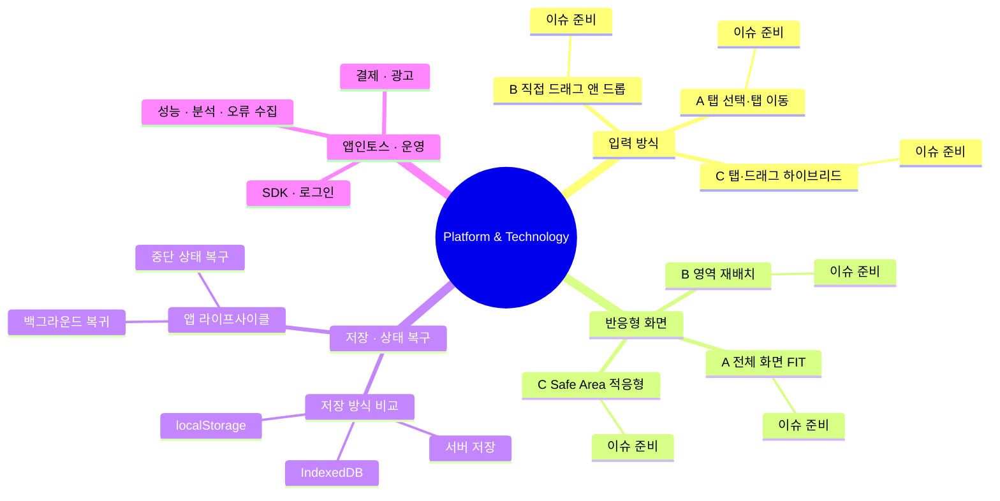
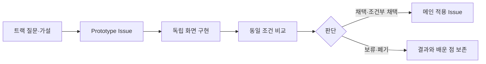

# Dream Bike Garage Lab 프로토타입 지도

> 기준일: 2026-08-05  
> 대상: `aigemro/dream-bike-garage-lab`

이 문서는 Dream Bike Garage Lab에서 진행 중인 기술 실험을 **트랙 → 프로토타입 → 비교·결정** 구조로 한눈에 확인하기 위한 공식 지도입니다. 새로운 방안이 생기면 기존 안을 덮어쓰지 않고 해당 트랙 아래에 Prototype을 추가합니다.

## 1. 기준 설계와 범위

현재 MVP 기준은 **고객 주문 → 온라인 부품 주문 → 택배 도착 → 동일 부품 2-to-1 머지 → 자전거 조립 → 납품·급여 → 내 자전거 수집**입니다.

- 현재 핵심: 캐주얼 머지, 주문 조립, 완성차 수집
- Lab 역할: 여러 구현안을 같은 조건으로 만들어 비교하고 선택 근거를 남김
- 메인 역할: Lab에서 선택한 결과를 기획·설계 기준에 맞춰 최종 적용
- 향후 확장: 브랜드 협업, 매치3, 레이스, 경영, 과금·광고는 MVP 검증 이후 별도 트랙으로 검토

## 2. 전체 실험 지도

## 3. Game Core 프로토타입

## 4. Platform & Technology 프로토타입

## 5. 현재 진행 현황

| 분류 | 트랙 | Prototype / 작업 | 현재 상태 | 다음 확인 | 관련 항목 |
|---|---|---|---|---|---|
| Game Core | 머지 코어 | A: 자유 보드 2-to-1 | 개발 중 | 웹브라우저 중심 레이아웃 PR 검토 및 플레이 테스트 | [#10](https://github.com/aigemro/dream-bike-garage-lab/issues/10), [PR #30](https://github.com/aigemro/dream-bike-garage-lab/pull/30), [PR #40](https://github.com/aigemro/dream-bike-garage-lab/pull/40) |
| Game Core | 머지 코어 | B: 주문 목표 중심 2-to-1 | 검토 준비 | 주문 카드 시각화 후 A/C와 목표 이해도 비교 | [#13](https://github.com/aigemro/dream-bike-garage-lab/issues/13), [PR #31](https://github.com/aigemro/dream-bike-garage-lab/pull/31) |
| Game Core | 머지 코어 | C: 자유 보드 + 주문 가이드 | 검토 준비 | 가이드 강도와 자유도의 균형 비교 | [#25](https://github.com/aigemro/dream-bike-garage-lab/issues/25), [PR #26](https://github.com/aigemro/dream-bike-garage-lab/pull/26) |
| Game Core | 수집 | A: 자전거 도감형 | 준비 | 최소 도감 화면과 획득 피드백 정의 | [#14](https://github.com/aigemro/dream-bike-garage-lab/issues/14) |
| Game Core | 수집 | B: Garage 전시·성장형 | 준비 | 전시와 성장 중 핵심 소유감 검증 | [#12](https://github.com/aigemro/dream-bike-garage-lab/issues/12) |
| Game Core | 주문·조립 | A: 조립 슬롯 직접 배치 | 준비 | 직접 배치의 조립감과 추가 피로 비교 | [#18](https://github.com/aigemro/dream-bike-garage-lab/issues/18) |
| Game Core | 주문·조립 | B: 조건 충족 즉시 자동 조립 | 준비 | 캐주얼 템포와 조립 성취감 비교 | [#17](https://github.com/aigemro/dream-bike-garage-lab/issues/17) |
| Game Core | 보상·성장 | A/B | 준비 | 고정 급여와 성과 보너스의 반복 동기 비교 | [#20](https://github.com/aigemro/dream-bike-garage-lab/issues/20), [#21](https://github.com/aigemro/dream-bike-garage-lab/issues/21) |
| Platform | 입력 방식 | A/B/C | 허브 반영 중 | 탭·드래그·하이브리드를 같은 보드에서 비교 | [#33](https://github.com/aigemro/dream-bike-garage-lab/issues/33), [PR #39](https://github.com/aigemro/dream-bike-garage-lab/pull/39) |
| Platform | 반응형 화면 | A/B/C | 허브 반영 중 | 모바일·태블릿·웹브라우저 조건별 비교 | [#4](https://github.com/aigemro/dream-bike-garage-lab/issues/4), [PR #39](https://github.com/aigemro/dream-bike-garage-lab/pull/39) |
| Platform | 저장·복구 | 방식 후보 | 준비 | MVP 저장 범위와 WebView 복구 조건 정의 | [#3](https://github.com/aigemro/dream-bike-garage-lab/issues/3), [#5](https://github.com/aigemro/dream-bike-garage-lab/issues/5) |
| Platform | 앱인토스·운영 | 기반 이슈 | 준비 | SDK·로그인 이후 결제/광고/운영 순차 검증 | [#6](https://github.com/aigemro/dream-bike-garage-lab/issues/6), [#7](https://github.com/aigemro/dream-bike-garage-lab/issues/7), [#8](https://github.com/aigemro/dream-bike-garage-lab/issues/8) |

상태는 `아이디어 → 준비 → 개발 중 → 검토 준비 → 검토 → 완료`로 관리하며, 결과는 `채택 / 조건부 채택 / 보류 / 폐기`로 별도 기록합니다.

## 6. 실험에서 메인 적용까지

## 7. 신규 트랙·프로토타입 추가 규칙

1. 기존 트랙의 해결 방안이면 해당 트랙 아래 Prototype을 추가합니다.
2. 검증 질문과 평가 기준이 다르면 새 트랙을 만듭니다.
3. 같은 트랙은 초기 보드·주문·데이터를 가능한 한 동일하게 유지합니다.
4. 구현 완료와 채택을 구분합니다. 실행 가능하더라도 비교 전에는 채택하지 않습니다.
5. 실험 결과에는 측정값, 관찰, 장점, 한계, 메인 적용 여부를 남깁니다.
6. 현재 MVP 밖의 브랜드·매치3·레이스·경영·과금 확장은 핵심 루프가 검증된 뒤 별도 트랙으로 승격합니다.

## 8. 설계 자료 해석 기준

- `Dream Bike Garage 머지게임 시스템 설계안`은 현재 핵심 루프와 MVP 범위의 기준 자료로 사용합니다.
- 기존 `글로벌 자전거 브랜드 매치3·머지 게임 마케팅 기획서`의 브랜드, 매치3, 레이스, O2O, 과금 아이디어는 폐기하지 않되 현재 MVP와 섞지 않고 향후 확장 후보로 보관합니다.
- 실제 브랜드명과 모델은 라이선스 또는 협업이 확정된 뒤 적용합니다.

---

관련 문서: [실험 운영 가이드](EXPERIMENT_GUIDE.md) · [기술 구성](TECH_STACK.md) · [프로젝트 역할 경계](PROJECT_BOUNDARY.md)
