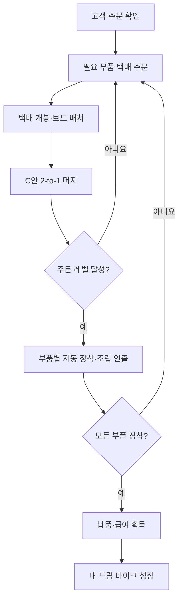

# MVP 핵심 루프 통합 검토

## 1. 검토 목적

머지 코어, 주문·조립, 부품 수급 트랙에서 각각 검토한 방안을 하나의 출시 MVP 플레이 흐름으로 연결하기 전에 기준 조합과 책임 경계를 정리합니다. 이 문서는 통합 구현을 확정하지 않으며, 다음 통합 작업의 검토 기준으로 사용합니다.

## 2. 기준 조합

| 영역 | 기준 후보 | 검토 결과 |
|---|---|---|
| 머지 코어 | C안: 자유 보드 + 주문 가이드 | 공간 판단과 현재 주문 목표를 함께 제공해 MVP 핵심에 가장 가까움 |
| 주문·조립 | 자동 조립 | 모바일 조작 부담을 줄이는 대신 단계별 장착 연출로 조립 성취감을 보완해야 함 |
| 부품 수급 | B안: 택배 상자 개봉형 | 온라인 부품 주문 세계관과 자연스럽고 도착·개봉의 기대감을 제공함 |

권장 기준 문장은 다음과 같습니다.

> C안 주문 가이드형 자유 보드에서 카테고리별 택배로 부품을 수급하고, 필요한 레벨까지 머지하면 부품별 자동 장착 연출을 거쳐 주문을 완성한다.

## 3. 예상 플레이 흐름

## 4. 트랙 구성 권고

기존 세 트랙은 개별 규칙을 비교하는 실험으로 유지합니다. 합쳐진 구성은 Game Core에 다시 넣기보다 별도 **Integration / MVP 핵심 루프 통합** 트랙에서 관리하는 것이 적합합니다.

- Game Core / 머지 코어: 보드 규칙과 주문 가이드 강도
- Game Core / 부품 수급: 생성·택배·생성기의 수급 템포
- Game Core / 주문·조립: 자동 조립과 직접 배치의 조작 규칙
- Game Core / 장착·조립 연출: 자동 조립 과정의 인지성과 성취감
- Integration / MVP 핵심 루프 통합: 선택된 규칙 간 상태 전이와 한 사이클 완주

통합 트랙은 각 기능을 다시 복제하는 곳이 아니라 주문 요구치, 보드 부품, 장착 상태, 납품 보상과 저장 상태가 끊김 없이 이어지는지 검증하는 곳입니다.

## 5. 통합 전에 결정할 항목

1. 택배를 카테고리 선택형으로 할지, 제한된 무작위형으로 할지
2. 목표 부품 완성 즉시 자동 소비할지, 짧은 확인 시간을 둘지
3. 장착 연출 중 다음 보드 조작을 허용할지
4. 주문 완료 후 남은 보드와 택배를 다음 주문에 유지할지
5. 자동 저장 시점을 택배 개봉·머지·장착·납품 중 어디에 둘지

## 6. 통합 구현 범위

Issue #114의 1차 기능 수직 슬라이스에서 주문 3종, 카테고리 택배, 자유 보드 2-to-1 머지, 목표 판정 자동 장착, 납품·급여·드림 바이크 성장과 로컬 저장을 연결합니다.

이번 구현은 기능 계약 검증이 목적이므로 화면 디자인, 아트 스타일, 자전거 모델 고도화, 장착 애니메이션과 사운드는 제외합니다. 관련 표현은 기존 Lab 기본 컴포넌트와 텍스트 상태 표시만 사용합니다.

## 7. 참고 기준

- Dream Bike Garage 머지게임 설계안: 온라인 주문, 2-to-1 머지, 조립대 장착, 납품 흐름
- Dream Bike Garage MVP 핵심 협의안: 주문 → 수급 → 머지 → 조립 → 납품 → 성장의 출시 MVP 정의
- `docs/LAB_PROTOTYPE_MAP.md`: 현재 Lab 트랙 및 Integration 경계
