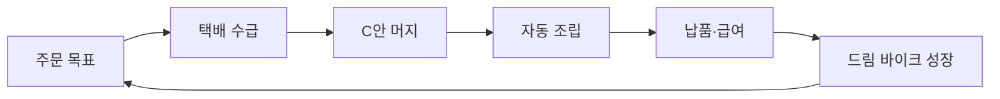

# 트랙 분류 운영안

> 기준일: 2026-08-15  
> 목적: 비대해진 Game Core를 책임과 검증 질문이 다른 상위 영역으로 분리한다.

## 1. 분류 원칙

기존 `Game Core`는 단일 트랙이 아니라 여러 실험 트랙을 담는 상위 범주였습니다. MVP 핵심 루프와 장기 성장, 화면 구조, 감각 표현, 기술 기반, 통합 검증의 평가 질문이 서로 달라 다음 여섯 영역으로 나눕니다.

| 상위 영역 | 담당 범위 | 포함하지 않는 것 |
|---|---|---|
| MVP 핵심 플레이 | 한 주문 안에서 사용자가 직접 수행하는 주문·수급·머지·조립 | 장기 성장, 플랫폼 구현 |
| 메타 성장 | 납품 이후 보상·수집·해금·커리어와 재플레이 동기 | 한 판의 세부 조작 |
| 화면 디자인 | 화면 단위 정보 구조·시선 흐름·조작 동선·전환 | 개별 에셋의 화풍·음악·효과음 |
| Art & Audio | 동일한 게임 상태를 전달하는 에셋·모션·시청각 표현 | 게임 규칙과 화면 정보 구조 |
| 플레이 기반 | 입력·화면·저장·WebView 등 공통 기술 | 재미 방안의 채택 결정 |
| 릴리스 통합 | 선택안을 하나의 출시 흐름으로 연결하고 완주·복구 검증 | 개별 트랙 방안 재구현·재비교 |

## 2. 트랙 배치

### MVP 핵심 플레이

- 주문 목표·반복 플레이
- 부품 수급
- 머지 코어
- 보드 막힘·복구
- 조립·완성 연출

`주문과 조립`은 책임이 섞이지 않도록 주문 목표는 `주문 목표·반복 플레이`, 장착과 완성 판정은 `조립·완성 연출`에서 다룹니다.

### 메타 성장

- 보상과 성장
- 자전거 수집
- 메인 홈·플레이 화면
- 레벨 디자인·콘텐츠 해금
- 직급·커리어 성장
- 주문 난이도·게임 경제

### Art & Audio

- 배경 디자인·Garage 공간 연출
- 캐릭터 디자인·표현 방향
- UI·아이콘 아트 방향
- 애니메이션·모션 표현 방향
- 게임 피드백·연출
- 배경음악·공간 분위기
- 효과음·조작 피드백

### 화면 디자인

- 홈 화면 디자인
- 게임 화면 디자인
- 자전거 수집 화면 디자인
- 프로필 화면 디자인
- 납품·보상 정산 화면 디자인
- 첫 플레이 안내 오버레이 디자인
- 설정 화면 디자인
- 타이틀·로딩 화면 디자인

조립 트랙은 장착 시점과 완료 판정을 정의하고, 화면 디자인은 정보 구조와 사용성을, Art & Audio는 그 상태를 어떤 에셋과 감각 언어로 보이고 들려줄지 비교합니다.

### 플레이 기반

- 입력 방식
- 반응형 화면
- 진행 상태 저장
- 앱인토스 WebView

### 릴리스 통합

- MVP 릴리스 통합
  - 플레이 코어 통합: 머지 코어 C안 + 택배 수급 + 자동 장착·조립
  - 수직 슬라이스 통합: 최종 화면 디자인·자전거 수집 A/B/C·오디오·저장 연결

## 3. 현재 MVP 선택안

| 연결 지점 | 선택안 | 통합 시 책임 |
|---|---|---|
| 주문 | 자동 다음 주문 | 현재 주문 완료 후 다음 주문 상태 생성 |
| 부품 수급 | 택배 상자 개봉형(B안) | 주문 → 배송 → 개봉 → 보드 투입 연결 |
| 머지 | 자유 보드 + 주문 가이드(C안) | 주문 목표 강조와 2-to-1 보드 상태 제공 |
| 조립 | 조건 충족 자동 조립(A안) | 준비 부품 판정과 단계별 완성 피드백 연결 |

이 선택은 통합 기준이며 기존 비교 방안을 삭제하거나 채택 결과로 확정한다는 의미가 아닙니다. Lab의 개별 트랙과 관련 Issue는 비교 근거로 계속 유지합니다.

부품 수급 D안(#196)은 B안의 주문·배송 규칙을 유지하고, **수동 배치 미리보기 + 선택형 자동 배치**만 비교하는 1차 UX 실험입니다. 릴리스 수직 슬라이스에서는 체크박스로 두 흐름을 모두 확인하며, 비교 결과 전에는 B안을 대체하는 최종 규칙으로 확정하지 않습니다.

## 4. 통합 트랙의 경계

`MVP 릴리스 통합`은 다음 흐름의 상태 전달과 완주 여부만 담당합니다.

- 화면과 상태 전환 계약
- 주문 완료와 다음 주문 생성
- 납품 보상과 성장 반영
- 저장·복구 시점
- 첫 주문부터 성장까지 진행 불가 오류 없는 완주
- 모바일·앱인토스 환경의 출시 QA

개별 머지 규칙, 수급 방식, 조립 방식을 통합 트랙에서 다시 비교하지 않습니다.

## 5. 신규 항목 분류 기준

1. 한 주문 중 직접 조작과 판정을 바꾸면 `MVP 핵심 플레이`에 둡니다.
2. 주문 완료 뒤 다음 플레이 이유와 장기 상태를 바꾸면 `메타 성장`에 둡니다.
3. 동일한 상태에서 화면의 정보 구조·시선 흐름·조작 동선을 바꾸면 `화면 디자인`에 둡니다.
4. 동일한 화면 구조에서 에셋·모션·음악·효과음을 바꾸면 `Art & Audio`에 둡니다.
5. 여러 게임 기능이 공유하는 실행 환경 문제면 `플레이 기반`에 둡니다.
6. 두 개 이상 선택안 사이의 상태 연결과 출시 완주를 검증하면 `릴리스 통합`에 둡니다.
